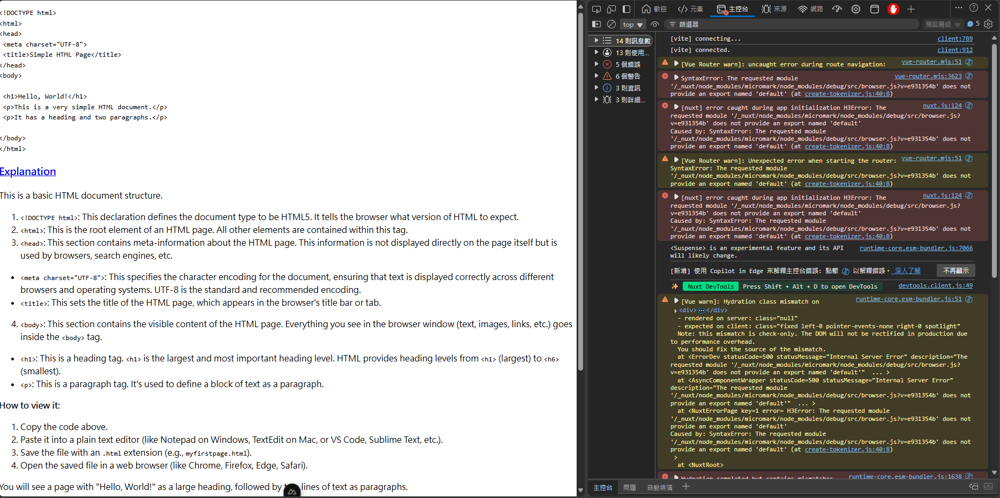

# Issue

When using bun as package manager, `import { parseMarkdown } from '@nuxtjs/mdc/runtime'` results in the following error:



```
vue-router.mjs:51 
 [Vue Router warn]: Unexpected error when starting the router: SyntaxError: The requested module '/_nuxt/node_modules/micromark/node_modules/debug/src/browser.js?v=e931354b' does not provide an export named 'default' (at create-tokenizer.js:40:8)
nuxt.js:124 
 [nuxt] error caught during app initialization H3Error: The requested module '/_nuxt/node_modules/micromark/node_modules/debug/src/browser.js?v=e931354b' does not provide an export named 'default'
Caused by: SyntaxError: The requested module '/_nuxt/node_modules/micromark/node_modules/debug/src/browser.js?v=e931354b' does not provide an export named 'default' (at create-tokenizer.js:40:8)
runtime-core.esm-bundler.js:7066 <Suspense> is an experimental feature and its API will likely change.
[新增] 使用 Copilot in Edge 來解釋主控台錯誤: 點擊 
 以解釋錯誤。 深入了解
不再顯示
devtools.client.js:49 ✨ Nuxt DevTools  Press Shift + Alt + D to open DevTools 
runtime-core.esm-bundler.js:51 
 [Vue warn]: Hydration class mismatch on 
 
  - rendered on server: class="null"
  - expected on client: class="fixed left-0 pointer-events-none right-0 spotlight"
  Note: this mismatch is check-only. The DOM will not be rectified in production due to performance overhead.
  You should fix the source of the mismatch. 
  at <ErrorDev statusCode=500 statusMessage="Internal Server Error" description="The requested module '/_nuxt/node_modules/micromark/node_modules/debug/src/browser.js?v=e931354b' does not provide an export named 'default'"  ... > 
  at <AsyncComponentWrapper statusCode=500 statusMessage="Internal Server Error" description="The requested module '/_nuxt/node_modules/micromark/node_modules/debug/src/browser.js?v=e931354b' does not provide an export named 'default'"  ... > 
  at <NuxtErrorPage key=1 error= H3Error: The requested module '/_nuxt/node_modules/micromark/node_modules/debug/src/browser.js?v=e931354b' does not provide an export named 'default'
Caused by: SyntaxError: The requested module '/_nuxt/node_modules/micromark/node_modules/debug/src/browser.js?v=e931354b' does not provide an export named 'default' (at create-tokenizer.js:40:8) > 
  at <NuxtRoot>
runtime-core.esm-bundler.js:1638 
 Hydration completed but contains mismatches.
runtime-core.esm-bundler.js:51 
 [Vue warn]: Hydration children mismatch on 
 
Server rendered element contains fewer child nodes than client vdom. 
  at <ErrorDev statusCode=500 statusMessage="Internal Server Error" description="The requested module '/_nuxt/node_modules/micromark/node_modules/debug/src/browser.js?v=e931354b' does not provide an export named 'default'"  ... > 
  at <AsyncComponentWrapper statusCode=500 statusMessage="Internal Server Error" description="The requested module '/_nuxt/node_modules/micromark/node_modules/debug/src/browser.js?v=e931354b' does not provide an export named 'default'"  ... > 
  at <NuxtErrorPage key=1 error= H3Error: The requested module '/_nuxt/node_modules/micromark/node_modules/debug/src/browser.js?v=e931354b' does not provide an export named 'default'
Caused by: SyntaxError: The requested module '/_nuxt/node_modules/micromark/node_modules/debug/src/browser.js?v=e931354b' does not provide an export named 'default' (at create-tokenizer.js:40:8) > 
  at <NuxtRoot>
runtime-core.esm-bundler.js:51 
 [Vue warn]: Hydration class mismatch on 
 
  - rendered on server: class="null"
  - expected on client: class="antialiased bg-white dark:bg-black dark:text-white flex flex-col font-sans min-h-screen pt-14 px-10 text-black"
  Note: this mismatch is check-only. The DOM will not be rectified in production due to performance overhead.
  You should fix the source of the mismatch. 
  at <ErrorDev statusCode=500 statusMessage="Internal Server Error" description="The requested module '/_nuxt/node_modules/micromark/node_modules/debug/src/browser.js?v=e931354b' does not provide an export named 'default'"  ... > 
  at <AsyncComponentWrapper statusCode=500 statusMessage="Internal Server Error" description="The requested module '/_nuxt/node_modules/micromark/node_modules/debug/src/browser.js?v=e931354b' does not provide an export named 'default'"  ... > 
  at <NuxtErrorPage key=1 error= H3Error: The requested module '/_nuxt/node_modules/micromark/node_modules/debug/src/browser.js?v=e931354b' does not provide an export named 'default'
Caused by: SyntaxError: The requested module '/_nuxt/node_modules/micromark/node_modules/debug/src/browser.js?v=e931354b' does not provide an export named 'default' (at create-tokenizer.js:40:8) > 
  at <NuxtRoot>
```

# Reproduction steps

1.  Use bun as package manager
```
bun install 
bun run dev
```
open the app and see the **error** in the console


2.  Use pnpm as package manager
```
rm -rf node_modules
pnpm install
pnpm run dev
```
open the app and see **no error** in the console

